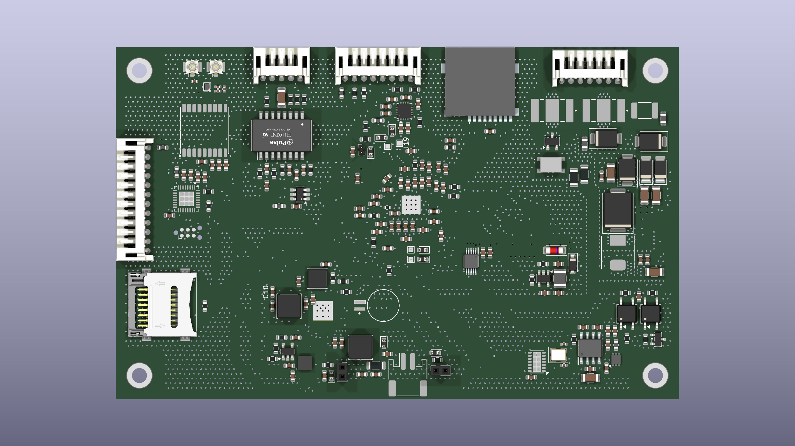
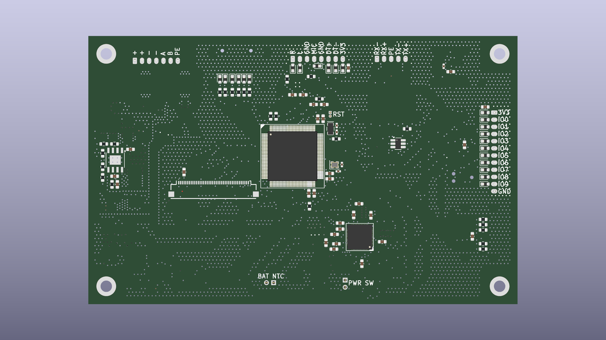
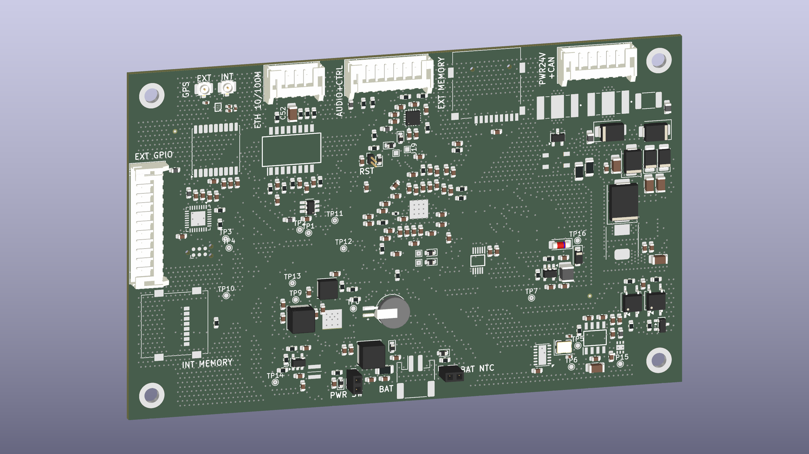

# ControlPanelV3S — Hardware

KiCad project for the CAN-bus control panel board built around the Allwinner V3S (LicheePi Zero),
part of the [CANbusSensors](../) family of MPCC/MPSWP sensor-node projects. Two assembly variants
on one PCB: a handheld CAN-bus terminal and a VoIP endpoint. The next hardware iteration (Allwinner
T113-S3/4) will be a separate repo.

## Status: ready for prototype order

- Schematic and PCB layout done (4-layer, 120 × 75 mm), production files generated.
- Design review completed; DRC/ERC clean (remaining items reviewed and excluded as by-design).
- Hand assembly (2 fiducials on F.Cu for stencil alignment); crystal load caps C3/C4 are placeholders to be tuned at bring-up.

Production outputs: [schematic PDF](prod/sch/ControlPanel.pdf) · [PCB PDF](prod/pcb/ControlPanel.pdf) · [interactive BOM](prod/ibom/ControlPanel_ibom.html) · [gerbers](prod/ControlPanelV3S.zip)

## Renders

3D renders straight out of KiCad (`pcb/gen_media.kicad_jobset`), not photos — no boards have been
fabricated yet.

| Top | Bottom | Angle |
|---|---|---|
|  |  |  |

## Layout

- **`pcb/`** - KiCad project: CPU, power, CAN transceiver front-end, display/touch, GPS, Ethernet,
  audio.
- **`doc/`** - hardware design decisions and reference material. Start with
  [doc/README.md](doc/README.md), which says which document is the source of truth for what.
- **`media/`** - 3D renders of the board, generated from the KiCad project.
- **`prod/`** - fabrication outputs (gerber + drill zip, BOM, interactive BOM, schematic/PCB PDFs).

## Firmware

The firmware that runs on this board (V3S-side kiosk app, CAN-bus device monitor, offline
navigation/map stack) lives in a separate, currently private companion repo.

## License

MIT for original work - see [LICENSE](LICENSE). All footprints live under `pcb/local_lib/` and
were either authored locally or sourced from SamacSys (`BAT_MS621FE-FL11E.kicad_mod`); 
FunKey S is referenced in `doc/` as a comparison point for the Allwinner V3S reference design 
(e.g. power-tree, boot ROM behavior).